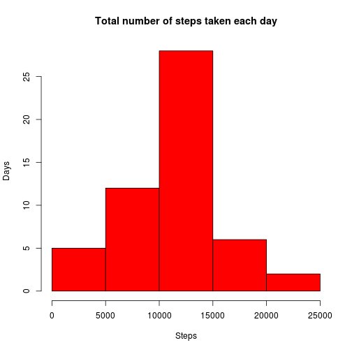
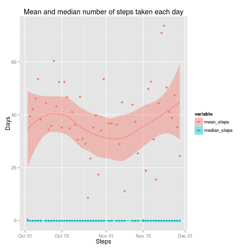
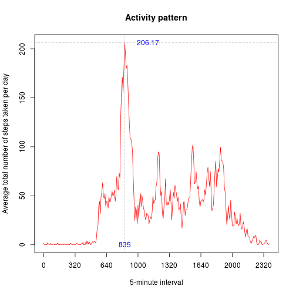
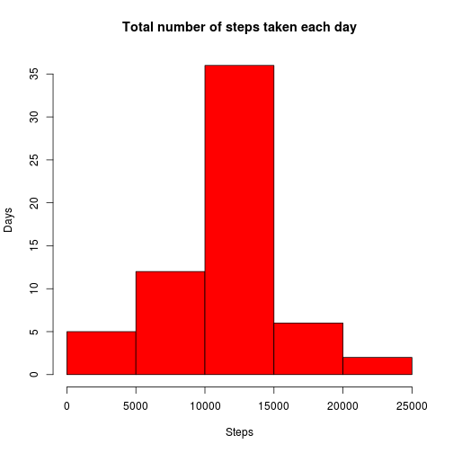
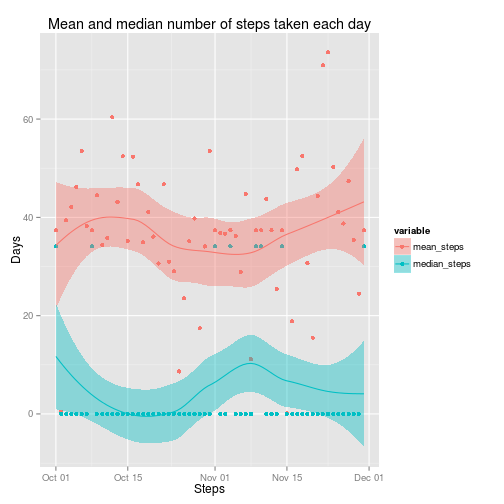
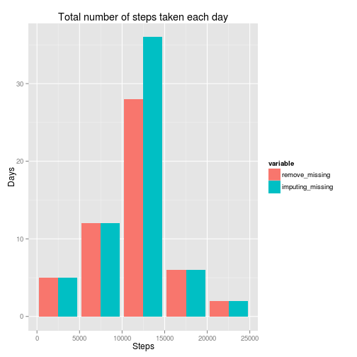
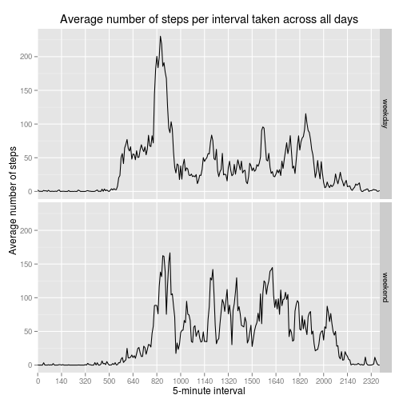
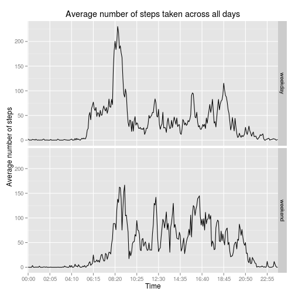

Load the necessary libraries.

```r
library(plyr, ggplot2, reshape2)
```

## Loading and preprocessing the data
Load the database:

```r
D <- read.csv(unz('activity.zip', 'activity.csv'), sep=',', header=T, stringsAsFactor=F)
```

Convert the date's field to Date class:

```r
D$date <- as.Date(D$date, "%Y-%m-%d")
```

Set length of interval in minutes, numbers of intervals per day, Numbers of days in the database.

```r
LengthInterval <- 5
IntervalsPerDay <- length(D$date[D$date==D$date[1]])
NumDays <- length(unique(D$date))
```

Generate fair values of intervals (5-minutes intervals between all values).

```r
vecFairIntervals <- seq(0, (IntervalsPerDay-1)*LengthInterval, LengthInterval)
```

Get vector of intervals from the database.

```r
vecIntervals <- unique(D$interval)
```

Create new variables "f_int" (fair intervals) and "time" by the 5-minute intervals.

```r
D <- transform(D, f_int=rep(vecFairIntervals, NumDays))
D <- transform(D, time=as.factor(paste(substr(sprintf("%04d", D$interval), 1, 2), ":", substr(sprintf("%04d", D$interval), 3, 4), sep="")))
```

Create a new factor variable "day" with two levels – “weekday” and “weekend”.

```r
D <- transform(D, day=as.factor(ifelse(weekdays(D$date) %in% c("Saturday","Sunday"),"weekend","weekday")))
```

## What is mean total number of steps taken per day?

Get database with complete cases (remove NA's rows).

```r
D_comp <- D[complete.cases(D),]
```

Calculate number, mean and median steps per days.

```r
ds <- ddply(D_comp, .(date), summarize, number_steps=sum(steps), mean_steps=mean(steps), median_steps=median(steps))
```

Make a histogram of the total number of steps taken each day.

```r
hist(ds$number_steps, main="Total number of steps taken each day", col="Red", xlab="Steps", ylab="Days")
```

 

Calculate and report the mean and median total number of steps taken per day.

```r
dsl <- melt(ds[,c(1,3,4)], id.vars="date")
ggplot(data=dsl, aes(date, value, fill=variable, col=variable)) + geom_point() + geom_smooth() +
    xlab("Steps") + ylab("Days") + ggtitle("Total number of steps taken each day")
```

```
## geom_smooth: method="auto" and size of largest group is <1000, so using loess. Use 'method = x' to change the smoothing method.
```

 


## What is the average daily activity pattern?

Get mean steps per interval averaged across all days.

```r
ds5 <- ddply(D_comp, .(f_int), summarize, mean_steps=mean(steps))
```

Restore variable "Interval" to label x-axis.

```r
ds5 <- transform(ds5, interval=vecIntervals)
```

Generate plot with custom x-axis and mark max value of steps.

```r
plot(ds5$f_int, ds5$mean_steps, main="Activity pattern", xaxt="n", col="Red", type="l", xlab="5-minute interval", ylab="Average total number of steps taken per day")
axis(1, at=vecFairIntervals[seq(1,length(vecFairIntervals),40)], labels=vecIntervals[seq(1,length(vecIntervals),40)])
abline(v=ds5[which.max(ds5[,2]),1], lty="dashed", col="Gray")
abline(h=max(ds5$mean_steps), lty="dashed", col="Gray")
text(ds5[which.max(ds5[,2]),1]+150, max(ds5$mean_steps), labels=sprintf("%4.2f", max(ds5$mean_steps)), col="Blue")
text(ds5[which.max(ds5[,2]),1], 0, labels=ds5[which.max(ds5[,2]),3], col="Blue")
```

 


## Imputing missing values


The total number of missing values in the dataset is **2304**.

Strategy for filling in all of the missing values in the dataset use the mean for that 5-minute interval. For this we create a new dataset that is equal to the original dataset but with the missing data filled in.

```r
D_full <- D
D_full$steps[is.na(D_full$steps)] <- ds5$mean_steps[match(D_full$interval, ds5$interval)][is.na(D_full$steps)]
```

Calculate number, mean and median steps per days.

```r
df <- ddply(D_full, .(date), summarize, number_steps=sum(steps), mean_steps=mean(steps), median_steps=median(steps))
```

Make a histogram of the total number of steps taken each day.

```r
hist(df$number_steps, main="Total number of steps taken each day", col="Red", xlab="Steps", ylab="Days")
```

 

Calculate and report the mean and median total number of steps taken per day.

```r
dfl <- melt(df[,c(1,3,4)], id.vars="date")
ggplot(data=dfl, aes(date, value, fill=variable, col=variable)) + geom_point() + geom_smooth() +
    xlab("Steps") + ylab("Days") + ggtitle("Total number of steps taken each day")
```

```
## geom_smooth: method="auto" and size of largest group is <1000, so using loess. Use 'method = x' to change the smoothing method.
```

 

As can be seen, values this histogram differ from values first histogram. These differences are explained the impact of imputing missing data.
 

## Are there differences in activity patterns between weekdays and weekends?

Calculate mean of steps per 5-minute interval across all weekday days or weekend days.

```r
dw5 <- ddply(D_full, .(f_int, day), summarize, mean_steps=mean(steps))
```

Restore variable "Interval" to label x-axis.

```r
dw5 <- transform(dw5[order(dw5$day),], interval=rep(vecIntervals,2))
```

Make a panel plot containing a time series plot of the 5-minute interval and the average number of steps taken, averaged across all weekday days or weekend days.

```r
qplot(f_int, mean_steps, data=dw5, facets=day~., geom=c("line"), xlab="5-minute interval", ylab="Average number of steps", main=expression("Average number of steps per interval taken across all days")) + scale_x_discrete(breaks=vecFairIntervals[seq(1,length(vecFairIntervals),20)], labels=vecIntervals[seq(1,length(vecIntervals),20)])
```

 


**Alternative view the average daily activity pattern**

For good view create the average daily activity pattern we make another plot with time x-axes.

```r
dwt5 <- ddply(D_full, .(time, day), summarize, mean_steps=mean(steps))
```

Make a panel plot containing the time and the average number of steps taken, averaged across all weekday days or weekend days.

```r
p <- ggplot(dwt5, aes(time, mean_steps, group=day)) + geom_line() + facet_grid(day~.) + ggtitle(expression("Average number of steps taken across all days"))
p + scale_x_discrete(breaks=dwt5[seq(1,length(dwt5$time),50),1]) + xlab("Time") + ylab("Average number of steps")
```

 
